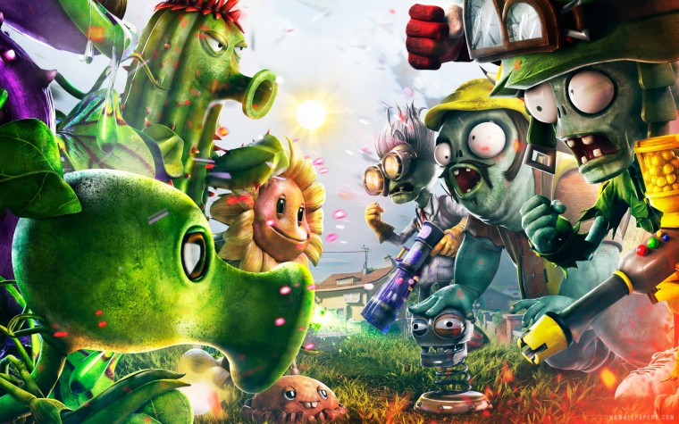

# PLANTS VS. ZOMBIES PROJECT          
Course: OBJECT - ORIENTED PROGRAMMING

<div id="top" align="center">

</div>

[![Contributors][contributors-shield]][contributors-url]

<!-- PROJECT LOGO -->
<br />
<div align="center">
  <a href="https://github.com/dtnghia2010/ProjectPvZ.git">
  </a>

  <h3 align="center">OOP PLANTS vs ZOMBIES PROJECT</h3>
  <h4 align="center">Team Name: NHỮNG KẺ KHỐN KHỔ</h4> 
  
  <p align="center">
    A Java game created with JavaFX for OOP course in International University - VNUHCM!
    <br />
    </div>
  
    
    <!-- TABLE OF CONTENTS -->
## Table of contents :round_pushpin:
1. [Introduction](# Introduction)
2. [Game](# Game)
3. [UML-class-diagram](#U ML-class-diagram)
4. [Features](# Features)
5. [Challenges](# Challenges)
6. [Acknowledgments](# Acknowledgments)
7. [References](# References)
    <!-- <details>
  <summary>Table of Contents</summary>
  <ol>
    <li>
      <a href="#Introduction">Introduction</a>
      <ul>
        <li><a href="#Team-members">Team Members</a></li>
	<li><a href="#installation">Installation</a></li>
	<li><a href="#motivation">Motivation</a></li>
	<li><a href="#task-allocation">Task Allocation</a></li>      
      </ul>
    </li>
    <li><a href="#technologies">Technologies</a></li>
    <li><a href="#uml-class-diagram">UML Class Diagram</a></li>
    <li><a href="#features">Features</a></li>
    <li><a href="#challenges">Challenges</a></li>
    <li><a href="#acknowledgments">Acknowledgments</a></li>
    <li><a href="#references">References</a></li>
  </ol>
</details> -->

<!-- ABOUT THE PROJECT -->
## Introduction <a name="Introduction"></a> :bricks:
   <div align="center">

</div>

<div style="text-align:justify">
This is our game project in our Object-Oriented Programming course in semester 2 (2022 - 2023). Plants vs Zombies is an individual game that does not require players have excellent skills or advanced technology. It's a straightforward game that may be enjoyed by people of all ages. As a result of all of these factors, we developed a program that is user-friendly and assists users in having the greatest possible experiences. So, what are we waiting for? Let the story begin!
</div>

### Team Members :couplekiss_man_man:

| Order |         Name          |     ID      |                       Github account                        |                        
| :---: | :-------------------: | :---------: | :---------------------------------------------------------: |
|   1   |     Dương Trọng Nghĩa      | ITITIU21256|[dtnghia2010](https://github.com/dtnghia2010)           | Trong Nghia |
|   2   | Lê Đăng Khoa | ITITIU21227 |[Khoakhoa2812](https://github.com/Khoakhoa2812) | Dang Khoa |
|   3   | Ngô Thị Thương | ITCSIU21160 |[thuongngo050902](https://github.com/thuongngo050902)               | Ngo Thuong |
|   4   |     Nguyễn Phạm Kỳ Phương   | ITITIU21287 |[npkyphuong04](https://github.com/npkyphuong04)        | Ky Phuong |

### Installation :dart: 

1. Open the terminal on your IDE
2. Clone the repo
   ```sh
   git clone https://github.com/dtnghia2010/ProjectPvZ
   ```
3. Check the file status
   ```sh
   git status
   ```
4. Change branch
   ```js
   git checkout 'branch_name'
   ```

### Motivation :mechanical_arm:

<div style="text-align:justify">
As a fresher developer, we assume that the Plants vs Zombies game is one of the most simple game which helps us in practicing coding with OOP also some significant aspects of the front-end such as: How to render the game? ,….
</div>

### Task Allocation :ok_man:

| Order | Task                                    |  Person   | 
| :---- | :-------------------------------------- | :-------: | 
| 1     | Zombies, Waves, Notification, Time logic,...|Trong Nghia|   
| 2     | Plants logic, Projectile of plants, Sun, Shovel, Animation,...| Dang Khoa | 
| 3     | Extra feature House owner, Zombie horde, Projectile logic,...| Ngo Thuong |  
| 4     | Buttons, Bar, Plants, Audio and Graphic design,...| Ky Phuong  | 


<!-- Game -->
<br />

## Game <a name="Game"></a>:joystick:
### Technologies :globe_with_meridians:

- Language: [JAVA](https://www.java.com/en/)
- Framework: [IntelliJ](https://www.jetbrains.com/idea/)
- Intelligent: [A\* algorithms](https://www.geeksforgeeks.org/a-search-algorithm/)
- Library: [Java.awt](https://openjawt.io) 
  
  
### How to play ? :video_game:
<div style="text-align:justify">

layers must prevent enemy zombies from crossing their front lawn and entering the house. When a horde of zombies begins to approach the house along parallel paths, the player must protect the house by planting trees on the path or use the House Owner to shoot bullets that destroy or harm them. Players collect a currency called "sun" to buy plants. If a zombie arrives at the house in any lane, that level is considered unsuccessful and the player will have to start that level again. After the player destroys all Zombies of this wave, the player will continue to the next wave (we have 3 waves).
</div>

### Game logic :bulb: 
- The game is divided into 2 main sides: plants and zombies. While the zombies try to attack the house, players will control the plants to defend the house at all cost. Sun is the main currency of this game, and it can be used to buy plant seeds. There are 2 main sun resources: from the sky or from the sunflower. There will be an initial amount of sun, so that player can set an initial defense at the start of the game. Zombies will come in each wave, with the wave after containing a larger amount of zombies, there will be a small gap between each wave. When a zombie is detected inside a land (row), the attacking plant will immediately fight against the zombie inside that land, up until the land is safe. Otherwise, the zombie will only attack when reaching the plants, they will stop and start attacking the plants. The game will be considered over if: a zombie manages to reach the house (lose) or all zombies in the last wave are defeated (win).

<div align="center">
</div>


<br />

### Game flow :bulb: 
- The first interface that appears when opening the game will be the MAIN MENU with 2 buttons: PLAY and EXIT. Selecting PLAY will bring up a PLAY screen and press the LET'S ROCK button on the screen, then Zombie will appear. Players use mouse or keyboard clicks to interact with the Plants in the Bar to grow plants against Zombies, or use a Shovel to dig up plants, or interact with the Sun on the screen. Players use mouse clicks to interact with the House Owner and move him to a location where Zombies can be attacked. When any Zombie passes all the cells, the player will lose and the LOSE screen will appear, the user will return to the main screen to restart the game from the beginning. If the player completes all the Waves, they win and return to the main screen. On the Playing screen there is a SETTING button, it is used to pause the game, then users can choose RESUME to continue the game, or EXIT to exit the game.

<div align="center">
</div>

<br />

###  Game description
    Character:
- Plants: Plants possess unique abilities and characteristics to protect the garden against zombies. They are strategically placed on the game's grid-like lawn to counter different types of zombies.
- Zombies: Zombies are the primary adversaries in the game, with the objective of invading the garden and devouring plants. Understanding the different zombie types and their behaviors is crucial for developing effective defense strategies.
- Crazy Dave the house owner: Crazy Dave, a playable character, adds a twist to the gameplay with his shooting abilities. Players can control his movement and strategically position him to maximize his shooting effectiveness.
    
<div align="center">
</div>

    Items:
 - Sun: Sun acts as a crucial resource that players must manage effectively to grow and sustain their plants. It is used to purchase and deploy plants in the garden.
- Projectile: Projectiles, such as peas, are used by plants to damage and eliminate zombies. Peashooters, Crazy Dave and House Owner launch projectiles to fend off the zombie threat.

<div align="center">
</div>
     
     Environment:
- Tile refers to the individual units on the playing field where players can place their defensive plants. The grid-based layout allows for strategic positioning and creating defensive formations.
- Selection Frame highlights the targeted tile, helping players identify and interact with specific tiles on the grid.
- Plant Bar is a user interface element that displays the available plant options for players to choose from. It allows players to select and place plants on the grid to defend against the incoming zombie horde.

<div align="center">
</div>
 
    User Manual:
    
<div align="center">
</div>

            
         Mouse Controller: 
                    Playing Plants vs. Zombies with a mouse is straightforward. 
                    Here's a general overview of how to control the game using a mouse:
   - Menu Navigation: Use the mouse cursor to select options in the game's menus.
   - Plant Selection: Click on plant icons to select and pick up a desired plant.
   - Plant Placement: Move the cursor to the desired location on the grid and left-click to place the selected plant.
   - Sun Collection: Move the cursor over falling sunlight to collect it as in-game currency for purchasing and placing plants.
   - Crazy Dave Movement: Click on the corresponding row to move the house owner to a desirable position.

<div align="center">
</div>

         Keyboard Controller: Similar to the mouse controller, the keyboard can be used to control the game:
   - Plant Selection: Use the arrow keys to navigate the plant bar and select desired plants or the shovel.
   - Plant Placement: Use the W, A, S, and D keys to move between tiles on the grid. Select the desired tile and press Enter to perform the action.
   - Sun Collection: Use the W, A, S, and D keys to move the selection frame. Sunlight will be collected automatically when the frame is on a tile containing sunlight.

<div align="center">
</div>

<br />

## UML Class Diagram<a name="UML-class-diagram"></a>:clipboard:
<!--  -->
<div>
	<h3>1.PLANTS AND ZOMBIES CLASS DIAGRAM </h3>
    <div align="center">
        
    </div>
    <br />
	<div align="center">------------------------------------</div>
    <br />
   <h3>2. PLANTS CLASS DIAGRAM </h3>
     <div align="center">
        
    </div>
    <br />
  <div align="center">------------------------------------</div>
  <br />
  <h3>3. ZOMBIES CLASS DIAGRAM </h3>
   <div align="center">
        
    </div>
    <br />
	<div align="center">------------------------------------</div>
    <br />
  </div>
  
  <!-- FEATURES -->
## Features<a name="Features"> :triangular_flag_on_post:
- Completed: UX/UI, sound of game, enhancing algorithms
- Incompleted: some new plants and natural conditions such as day or night
<br />

<!-- CHALLENGES -->
## Challenges<a name="Challenges">:bangbang:
- Working environment (Github)
<br />
  
  ## Acknowledgments<a name="Acknowledgments">:brain:
<div style="text-align:justify">
We would like to express our sincerest thanks to the teachers and people who helped us achieve the goal of this project:
  <br />
    - Dr. Tran Thanh Tung - Deputy Faculty of Information Technology - International University - Vietnam National University, Ho Chi Minh City
  <br />
    - MSc. Pham Quoc Son Lam - Lecturer at Faculty of Information Technology - International University - Vietnam National University, Ho Chi Minh City
</div>

<br />
  ## References<a name="References">  :eye::tongue::eye:
  1. [Tower defense](https://www.youtube.com/playlist?list=PL4rzdwizLaxb0-TajNIp5DOoT_PAxhx0T)
2. [Game loop](https://www.youtube.com/watch?v=lW6ZtvQVzyg&t=191s&pp=ygUQZ2FtZWxvb3AgaW4gamF2YQ%3D%3D)
3. [GUI](https://www.youtube.com/watch?v=7GaAW-DdPuI&pp=ygUOamZyYW1lIGluIGphdmE%3D)
4. [Mouse listener](https://www.youtube.com/watch?v=jptf1Wd_omw&t=197s&pp=ygUdbW91c2VsaXN0ZW5lciBhbmQga2V5bGlzdGVuZXI%3D)
5. [SOLID principles](https://www.youtube.com/watch?v=_jDNAf3CzeY&pp=ygURY29kZSBnYW1lIGluIGphdmE%3D)

<br />

<p align="right">(<a href="#top">Back to top</a>)</p>

<!-- MARKDOWN LINKS & IMAGES -->
<!-- https://www.markdownguide.org/basic-syntax/#reference-style-links -->
  
  [contributors-shield]: https://img.shields.io/github/contributors/dtnghia2010/ProjectPvZ.svg?style=for-the-badge
[contributors-url]: https://github.com/dtnghia2010/ProjectPvZ/graphs/contributors
  
  


               
            


  
    
